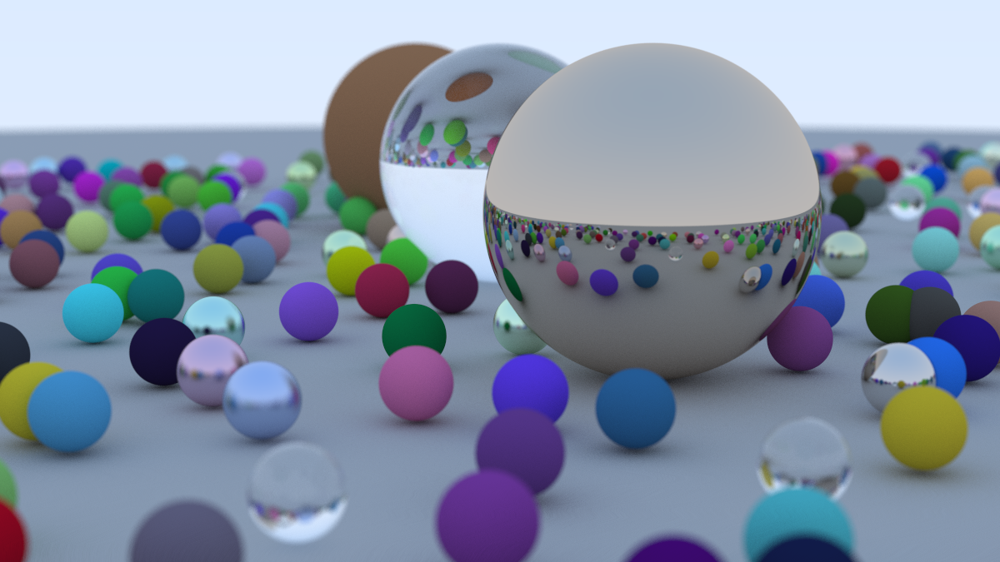
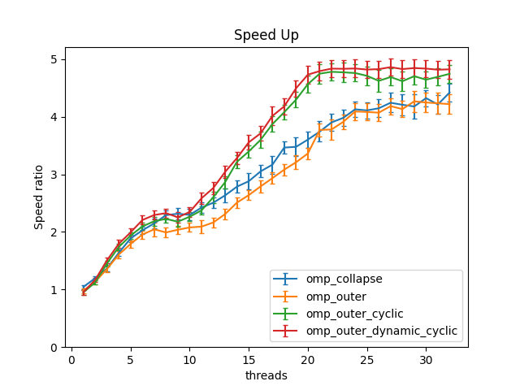
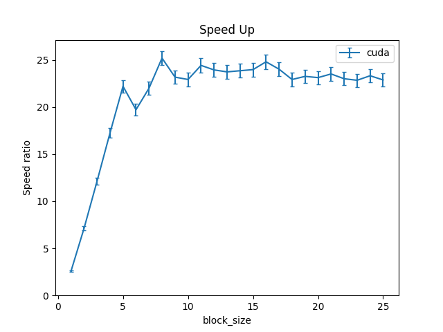
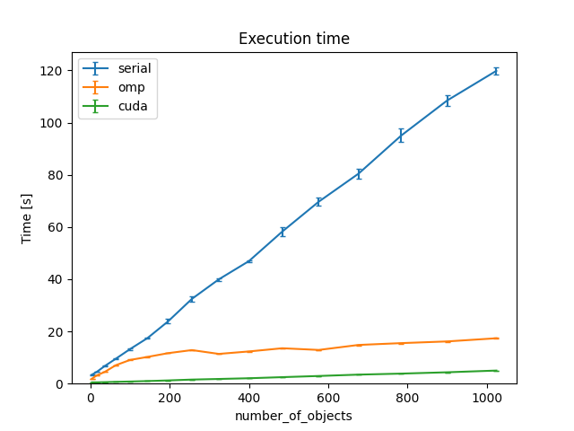

# Parallelized Ray Tracing In One Weekend

The parallelized code for the [book](https://raytracing.github.io/v3/books/RayTracingInOneWeekend.html), Ray Tracing in One Weekend by Peter Shirley.

## Environment

### Hardware

- CPU: Intel(R) Xeon(R) Silver 4210 CPU @ 2.20GHz (10 cores 20 threads)
- GPU: NVIDIA RTX 2080Ti 12GB
- RAM: DDR4 2666MHz 128GB

### Software

- Host OS: Ubuntu 20.04
- Container: Docker engine 24.0.6 with rootless mode
- Guest OS: Ubuntu 22.04
- Linux kernel: 5.15.0-87-generic
- OpenMP: 4.5
- CUDA: 12.3
- GCC: 11.4.0

## How to build?

```bash
export CMAKE_BUILD_TYPE="Release"

# build all implementations with the best settings
CUDAFLAGS="-DCUDA_BLOCK_SIZE=8" cmake -B build . && cmake --build build
```

## How to run?

```bash
# run serial implementation
./build/serial/InOneWeekend > test.ppm

# run OpenMP implementation
OMP_NUM_THREADS=22 ./build/openmp/OMPInOneWeekend > test.ppm

# run CUDA implementation
./build/cuda/CUDAInOneWeekend > test.ppm
```

## Samples

### Sample 10 times per pixel


### Sample 500 times per pixel



## Benchmark

### Notice

These scripts are for reference only. If you want to reproduce the result, the OpenMP implementation is much more tricky. You have to change the scheduling method by yourself in `openmp/src/main.cc`.

### Before running

We provide the devcontainer to quickly set up the enviroment (for rootless docker only). If you want to set up by yourself, you can follow the Dockerfine in `.devcontainer` folder to install.

### OpenMP

```bash
./scripts/benchmark_omp.sh
```

### CUDA

```bash
./scripts/benchmark_omp.sh
```

### Map size

```bash
./scripts/benchmark_map_size.sh
```

## Benchmark results

### OpenMP



### CUDA



### Map size (Number of objects)



## Reports

- [Final Presentation](docs/Group%205%20-%20Parallelized%20Ray%20Tracing%20In%20One%20Weekend.pdf)
- [Final Report](docs/final.pdf)
- [Project Proposal](docs/proposal.pdf)
